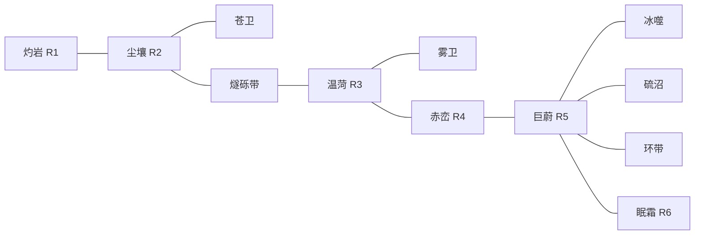

# 02 世界与生存

本文档定义时间体系、曦光系的 12 个星体、原料分布、殖民者的生存需求与灾害。所有标注"初始值"的数字允许在 ±50% 平衡窗口内调整(调整记录在对应里程碑 PR 描述中);表结构、系统联动、星体身份与归属不得更改。

## 时间体系(全局常量)

| 常量 | 值 |
|---|---|
| 1 游戏日 | 24 游戏时 = 12000 tick |
| 1 游戏时 | 500 tick |
| 1× 速度 | 10 tick / 真实秒(1 游戏日 = 20 真实分钟) |
| 速度档 | 暂停 / 1× / 2× / 4×(2× 与 4× 按帧预算允许追帧,追不上则时间变慢并在 UI 提示) |
| 星图刻(势力沙盘结算) | 每 1 游戏时一次 |
| 抽象刻(非活跃区域结算) | 每 1 游戏时一次 |
| 昼夜 | 尘壤:12 时昼 + 12 时夜;其余星体见各自条目 |

## 曦光系(默认星系)

恒星"曦光",K 型橙矮星。6 条轨道环(R1 内至 R6 外),12 个可殖民星体。星体身份、归属、独有资源固定;地形、矿脉位置、数值按游戏种子生成。

| # | 星体 | 位置 | 类型 | 重力 | 大气 | 主要原料 | 独有资源 | 危害 | 初始归属 | 登陆区数 |
|---|---|---|---|---|---|---|---|---|---|---|
| 1 | 灼岩 | R1 | 熔岩星 | 0.8g | 无 | 铁矿、铜矿、钛砂、硫 | 曜金矿 | 昼灼(白昼设备过热) | 中立 | 2 |
| 2 | 尘壤 | R2 | 荒漠温带星(出生星) | 1.0g | 稀薄 CO2 | 铁矿、铜矿、石英砂、盐、碳矿、钛砂、铝土、水冰、生物质(稀疏灌丛) | 无 | 沙暴、夜寒 | 玩家 | 3 |
| 3 | 苍卫 | R2 卫星 | 岩质卫星 | 0.3g | 无 | 石英砂、铝土、镍铁砾、稀土(贫矿) | 无 | 流星雨 | 中立 | 2 |
| 4 | 燧砾带 | R2–R3 间 | 小行星带 | 0g | 无 | 镍铁砾、碳矿、水冰 | 无 | 微陨石 | 中立 | 2 |
| 5 | 温菏 | R3 | 菌沼星 | 0.9g | 浓密可呼吸下限 | 生物质、菌木、甲烷冰、藻种 | 菌金胞 | 孢子雾 | 星贸商盟(贸易型)母星 | 3 |
| 6 | 雾卫 | R3 卫星 | 冰卫星 | 0.2g | 无 | 氮冰、氨冰、水冰 | 无 | 极寒 | 中立 | 1 |
| 7 | 赤峦 | R4 | 铁锈荒漠星 | 1.1g | 稀薄 | 铁矿、稀土矿、硫 | 绯铀 | 辐射带 | 赤旗军团(扩张型)母星 | 3 |
| 8 | 巨蔚 | R5 | 气态巨行星 | 不可着陆 | 氢氦 | 氢(气矿) | 氦-3 | 风暴层 | 中立 | 1(轨道平台) |
| 9 | 冰噬 | R5 卫星 | 冰壳卫星 | 0.4g | 无 | 水冰、氨冰 | 重氢冰 | 极寒 | 中立 | 2 |
| 10 | 硫沼 | R5 卫星 | 火山卫星 | 0.5g | 硫化物薄层 | 硫、碳矿 | 无 | 喷发 | 中立 | 2 |
| 11 | 环带 | R5 行星环 | 碎石环 | 0g | 无 | 镍铁砾、水冰 | 铂族砂 | 微陨石 | 中立 | 1 |
| 12 | 眠霜 | R6 | 冰矮星 | 0.6g | 无 | 水冰、氮冰、石英砂 | 超导蓝矿、相变凝胶原浆 | 极寒、极夜 | 静默会(封闭型)母星 | 2 |

备注:

- 独有资源共 8 种,其中 3 种在势力母星(菌金胞、绯铀、超导蓝矿+相变凝胶原浆同星双收),5 种在中立远星(曜金矿、氦-3、重氢冰、铂族砂——第 8 种即相变凝胶原浆与超导蓝矿同在眠霜)。获取途径:自行殖民中立星、与商盟贸易、占领势力母星。终局巨构"跃迁灯塔"需要其中至少 2 种(见 `01`)。
- 巨蔚不可着陆,其"登陆区"是一座轨道气矿平台(特殊区域类型:无地形,建筑格 32×32,只允许轨道系建筑)。
- 温菏大气达可呼吸下限:该星区域内殖民者舱外氧气消耗减半(不免除)。

### 星体邻接图(势力扩张与转移时间共用)

邻接定义:同环行星与其卫星相邻;相邻轨道环的行星相邻;小行星带与两侧行星相邻;巨蔚的三个伴随体(冰噬、硫沼、环带)彼此经巨蔚间接相邻。AI 势力只能向邻接星体扩张(见 `07`)。

## 原料总表(28 种)

| 类别 | 原料 | 采集方式 |
|---|---|---|
| 金属矿(9) | 铁矿、铜矿、铝土、钛砂、镍铁砾、稀土矿、绯铀※、铂族砂※、超导蓝矿※ | 手镐(T0)/ 采矿机、深井钻机 |
| 非金属(8) | 石英砂、盐、硫、尘壤土(regolith)、碳矿、曜金矿※、相变凝胶原浆※、菌金胞※ | 手镐 / 采矿机;菌金胞用蜂巢采集站 |
| 挥发物(7) | 水冰、CO2 冰、氮冰、氨冰、甲烷冰、重氢冰※、氦-3※ | 采冰机、集气塔;氦-3 只出自轨道气矿平台 |
| 有机物(4) | 生物质、菌木、孢子朊、藻种 | 手工采收(T0)/ 蜂巢采集站、菌木伐木架 |

※ 为独有资源(仅特定星体存在,见星体表)。

区域内矿脉规则:每块登陆区域按种子生成 4–9 处矿脉与散布资源点;出生区域保证下限——铁矿、铜矿、石英砂、盐、碳矿、水冰各至少 1 处且距坠毁点 ≤60 格,生物质灌丛散点 ≥6 处(新手可达性验收依赖此规则);尘壤全星另保证钛砂与铝土矿脉各 ≥1 处,可分布在任意登陆区(火箭部件链的可达性依赖此规则)。

## 殖民者

初始 4 名幸存者。坠毁舱初始库存:应急口粮 ×12、水 ×8、藻种 ×20、满气瓶 ×8(教学与前两日的缓冲——水链自建需要约一天半,缓冲桥接这段时间;也是配方可达性校验的合法起点之一,见 `04`)。后续来源:孵化舱建筑(消耗食物与星币周期产出 1 人)、商盟购买的殖民者合同、脚本救援事件(每局一次)。

单区域殖民者上限 60 人,机器人上限 120 台(性能预算依据,见 `08`)。

### 需求(初始值;单位统一为"每游戏时",1 游戏时 = 500 tick)

| 需求 | 满值 | 消耗与回复 | 归零后果 |
|---|---|---|---|
| 氧气 | 100 | 舱内:6 氧/时,由氧气网络(M1 阶段为指挥核心内建气罐)供给;舱外:消耗随身气瓶 12 氧/时,气瓶容量 30 氧(约管 2.5 时),低于阈值自动回充装点换瓶;断气时氧气需求 250/时流失 | 进入濒危:1 游戏时(1× 速度下 50 秒)未救治即死亡 |
| 水 | 100 | 消耗 100/游戏日;取水饮用一次回满(消耗 1 单位水) | 濒危同上 |
| 食物 | 100 | 消耗 100/游戏日;进食一次回满(消耗 1 份食物,无食堂时就地吃口粮) | 濒危同上 |
| 睡眠 | 100 | 消耗 100/16 时;卧床回复 100/7 时(无床位地面睡回复减半且暴露于体温压力);低于 20 强制寻找床位 | 昏倒原地 2 游戏时,士气 -15 |
| 体温 | 100 | 舱外夜间或极寒星体流失 20/时(保温服减半);舱内或加热范围回复 50/时 | 濒危同上 |

濒危状态:头顶红色图标 + 全局告警;库存有绷带时自动消耗 1 个,对应需求 +30(争取抢救时间);被救治或需求回补即解除。死亡永久,尸体需搬运掩埋(士气事件)。

### 士气(0–100,初始 60)

| 影响项 | 值(初始值) |
|---|---|
| 住房层级:睡舱 / 宿舍 / 家庭舱 | +0 / +5 / +12(持续) |
| 食物种类 ≥2 / ≥3 | +5 / +10(持续) |
| 娱乐舱、酒吧、观星台覆盖 | 各 +5(持续,需每日到访) |
| 同伴死亡 | -20(衰减 5/日) |
| 连续夜班 | -5/日 |
| 遭袭击 | -10(衰减 5/日) |
| 效果 | 士气 ≥70:工作速度 +10%;≤30:-15%;≤20:随机罢工(当日拒绝分配) |

### 工种(8 种)

矿工、搬运员、建造工、操作员(机台)、农夫、厨师、医师、研究员。玩家在职业面板设定每工种人数配比与优先级(P0–P4);调度器按优先级派工(见 `03`)。战斗不设人类工种,由战斗蛛承担(见 `07`)。

## 机器人(5 型)

| 型号 | 职能 | 解锁 |
|---|---|---|
| 搬运蛛 | 地面搬运,载 4 堆叠 | T1 |
| 工程蛛 | 建造与维修 | T2 |
| 采矿蛛 | 采集矿脉与散点 | T2 |
| 战斗蛛 | 战斗单位,武器可换装 | T3 |
| 快递无人机 | 空运 1 堆叠,无视地形,港口半径 40 格 | T2 |

机器人不消耗生存资源,消耗电力(回充桩)与周期维护件(维修凝胶,消耗品配方)。机器人是"从手到机器"支柱的最后一环:T3 后玩家可以实现零人力体力劳动,殖民者转入操作员/研究员等岗位。

## 灾害表(固定 4 类 + 星体特有)

| 灾害 | 出现星体 | 预警 | 效果(初始值) | 对策 |
|---|---|---|---|---|
| 沙暴 | 尘壤、赤峦 | 提前 1 游戏日气象预报 | 持续 6–12 游戏时:太阳能 -80%,暴露机器每时 2% 耐久损伤,舱外工作禁止 | 风机不受影响;检修棚;提前囤电 |
| 夜寒/极寒 | 尘壤(夜)、雾卫、冰噬、眠霜(常态) | 无(周期性) | 体温压力(见需求表);管线未保温则液体配方停机 | 加热塔、保温服、管线保温升级 |
| 流星雨/微陨石 | 苍卫、燧砾带、环带 | 提前 2 游戏时 | 随机 3–8 落点,落点建筑 30% 耐久伤害 | 哨戒炮可拦截(每炮拦 1 颗)、分散布局 |
| 孢子雾 | 温菏 | 提前 6 游戏时 | 持续 1 游戏日:舱外殖民者每时 -10 士气并 5% 概率患病(医疗舱治疗) | 孢子疫苗(商盟分支)、停舱外作业 |
| 昼灼 | 灼岩 | 周期性(昼) | 白昼暴露机器过热:效率 -50% | 夜间作业排程、散热鳍升级 |
| 辐射带 | 赤峦 | 常驻区块(地图标注) | 区块内殖民者每时 -5 生命,机器人不受影响 | 铅衬服、优先派机器人 |
| 喷发 | 硫沼 | 提前 4 游戏时 | 火山口半径 20 格岩浆覆盖,建筑摧毁 | 建筑避开标注危险区;喷发后产出硫矿富集点 |

设计约束:灾害全部来自本表,执行时不得新增随机事件类型(范围守恒)。所有灾害必须有预警(常驻类在地图标注)、有对策、有 UI 告警条目。

## 难度预设(3 档)

| 参数 | 和风 | 标准 | 严酷 |
|---|---|---|---|
| 灾害频率 | ×0.5 | ×1 | ×1.5 |
| 需求消耗速率 | ×0.75 | ×1 | ×1.25 |
| 赤旗军团袭击强度 | ×0.5 | ×1 | ×1.5 |
| 殖民者死亡 | 濒危时间 ×2 | 标准 | 标准 |
| 势力实力成长 | ×0.75 | ×1 | ×1.25 |

难度只调倍率,不开关系统。自定义难度界面允许玩家单独调整以上 5 项倍率。

## 反死亡螺旋保底(固定 3 项)

1. 应急口粮:手工台可用 2 生物质压制 1 应急口粮,T0 可用,无解锁条件。
2. 氧气缓冲告警:氧气网络储量低于 2 游戏时消耗量时,全屏横幅告警并自动暂停(设置可关)。
3. "最后一人"救援:殖民者数量降到 1 时,触发一次性脚本事件:3 游戏日后一艘中立救援舱带 2 名殖民者与 200 应急物资抵达。每局仅一次。
