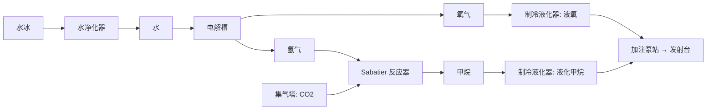

# 04 配方、物品与科技

本文档定义配方体系的生成规则与治理流程。核心思路:配方不是一条条手敲的,而是由"材料 × 工艺 × 形态"矩阵加人工维护的有效性掩码,经仓库内工具 `RecipeGen` 批量生成,再由 8 项自动校验与人工抽审把关。这样才能做到"组合爆炸的几百条、每条都讲得通、且平衡可维护"。

## 物品分类学

- 原料 28 种:见 `02-world-and-survival.md` 原料总表。
- 中间品约 60 种:锭、板、线、齿轮等成形件,酸、聚合物、燃料等化工品。
- 部件约 50 种:电路、电机、传感器、电芯、喷管、框架等。
- 终端产品:建筑 72 种、载具与火箭部件 20 种、消耗品与食品 25 种。
- 每个物品字段:`id`(稳定字符串键)、显示名(zh/en)、类别、层级 T0–T4、堆叠规格、属性标签(见下)、图标参数。

### 材料属性标签(驱动配方合理性)

每种材料挂 1–4 个属性标签:导电、轻质、耐热、耐蚀、绝缘、高强、催化、易燃、超导、储能。标签有两个用途:其一,有效性掩码的初筛依据(例如"拉丝"只对导电或高强材料开放);其二,合理性文案的用途从句来源(例如铝的"轻质"标签生成"用于轻型布线与机身")。

## 工艺 14 种(每种对应一个机器家族)

| 工艺 | 机器 | 手工版(T0) | 输出形态域 |
|---|---|---|---|
| 破碎 | 破碎机 | 手工台(慢速) | 粉、砾 |
| 熔炼 | 熔炉/电弧炉 | 篝火炉(限小件) | 锭 |
| 合金 | 电弧炉 | 无 | 合金锭 |
| 铸轧 | 铸轧机 | 无 | 板、杆 |
| 拉丝 | 拉丝机 | 无 | 线 |
| 机加工 | 机加工台 | 手工台(慢速,限 T1 件) | 齿轮、管、精密件 |
| 压制 | 压制机 | 手工台(慢速) | 砖、网 |
| 电解 | 电解槽 | 无 | 气、液、金属 |
| 蒸馏 | 蒸馏塔 | 无 | 液、气 |
| 化合 | 化工釜 | 无 | 液、粉 |
| 聚合 | 聚合反应器 | 无 | 聚合物 |
| 液化/制冷 | 制冷液化器 | 无 | 液化气 |
| 培养 | 培养槽 | 徒手采收(见映射表) | 生物质制品 |
| 组装 | 装配机 | 手工台 | 部件、成品 |

## 形态 14 种

锭、板、杆、线、齿轮、管、网、粉、砖、气、液、电芯、电路、框架。

## 层级 T0–T4

| 层级 | 主题 | 解锁工艺 |
|---|---|---|
| T0 | 徒手求生 | 手镐、手工台、篝火炉 |
| T1 | 通电 | 破碎、熔炼、铸轧、压制、组装(机器版) |
| T2 | 化工 | 电解、蒸馏、化合、拉丝、机加工、合金 |
| T3 | 高技术 | 聚合、液化、精炼、Sabatier |
| T4 | 航天与终局 | 轨道采集、巨构装配 |

## 配方生成矩阵

### 数据源(全部入库,人工可审可改)

| 文件 | 内容 | 维护方式 |
|---|---|---|
| `data/materials.csv` | 28 原料 + 合金/化工产物的属性标签、层级、来源星体 | 人工 |
| `data/verbs.csv` | 14 工艺的机器、速率基准、电耗基准、文案模板引用 | 人工 |
| `data/form_mask.csv` | 材料 × 形态有效性掩码(行 = 材料,列 = 形态,值 = 有效层级或空) | 人工(这是"讲得通"的第一道闸) |
| `data/alloys.csv` | 12 种合金的组成与属性(见下) | 人工 |
| `data/chem_graph.csv` | 化工反应边表(输入组合 → 输出,含配比) | 人工 |
| `data/components.csv` | 部件与终端产品的手工配方(输入引用中间品) | 人工 |
| `data/rationale_templates.csv` | 合理性文案模板(zh/en 各一列,含槽位) | 人工 |

`RecipeGen` 读取以上表,输出 `GeneratedData/recipes.json`、`GeneratedData/items.json`、校验报告 `GeneratedData/validation_report.md`。生成结果入库(便于 diff 审查),运行期只读 JSON。

### 合金 12 种(锁定清单)

钢(铁+碳)、青铜(铜+锡——锡由镍铁砾精炼副产)、硬铝(铝+铜)、钛合金(钛+铝)、殷钢(铁+镍)、电工硅钢(铁+硅)、耐热曜金钢(钢+曜金※)、超导合金(超导蓝矿+铜※)、铂催化网材(铂族+镍※)、铀燃料芯(绯铀+锆——锆由钛砂副产※)、生物复合材(菌金+聚合物※)、相变复合材(相变凝胶+铝※)。

※ 依赖独有资源:这 6 种合金把"殖民/贸易/占领"与生产链直接挂钩——没有对应星体的资源,链条就断,这是星系博弈的经济动机。

### 生成规则(伪代码)

```
for material in 可成形材料(纯金属 9 + 合金 12):
    for form in 形态域:
        if form_mask[material][form] 非空:
            生成配方 {
                inputs: 上游形态(锭/板按工艺链推导),
                verb: 由 form 反查工艺,
                outputs: material_form 物品(自动注册),
                tier: max(材料层级, 工艺层级, 掩码标注层级),
                time/energy: verbs.csv 基准 × 材料难度系数,
                rationale: 模板实例化(见下)
            }
chem_graph 与 components 表直接翻译为配方(手工配比,不走矩阵)。
```

### 合理性文案模板(支柱 2 的落地)

每条配方的 `rationale` 字段由模板实例化,zh/en 双语生成。模板槽位:{材料}、{形态}、{工艺}、{属性从句}、{用途从句}。属性从句与用途从句由材料属性标签查表得出。

示例模板(拉丝):`{材料}锭经拉丝机拉制成{材料}线。{属性从句},{用途从句}。`

实例:"铝锭经拉丝机拉制成铝线。轻质导电,用于轻型布线与线圈绕组。"

实例:"超导合金锭经拉丝机拉制成超导线材。零电阻传输,用于超导电网与磁约束装置。"

治理:模板与标签查表都在 CSV 里,人工抽审不过关时改表重新生成,不改生成器代码。

## 校验 8 项(`RecipeGen --validate`,CI 阻断)

1. **可达性**:以"尘壤全星可采原料 + 坠毁舱初始库存(见 `02`)"为起点做 BFS,T0–T2 配方 100% 可达,火箭部件与其燃料链(T3)同样 100% 可达(保证玩家不出星也能造出第一枚火箭);其余 T3/T4 配方允许依赖外星原料,但必须标注来源星体且该星体真实产出该原料。
2. **无孤儿物品**:每个物品至少被 1 条配方产出,且(消耗品/建筑/终端白名单以外)至少被 1 条配方消耗。
3. **无死端配方**:每条配方的产物有用途(白名单同上)。
4. **能量单调**:沿生产链累计电力成本严格递增,禁止免费能源环(检测:构建物品图,任何环上的能量净增益 > 0 即报错)。
5. **质量守恒警告**:输出总质量 > 输入总质量 × 1.3 时告警(气体参与的反应豁免),人工复核后可加白名单。
6. **解锁覆盖**:每条配方恰好属于 1 个科技节点;单节点配方数 ≤ 14。
7. **图标存在**:每个物品的图标参数可被 `IconComposer` 解析(见 `05`)。
8. **本地化键存在**:每个物品与配方的 zh/en 显示名、rationale 键在本地化表中存在且非空。

## 配方计数(目标 344,允许带宽 320–420)

| 类别 | 条数 | 生成方式 |
|---|---|---|
| A 冶炼与合金(纯金属冶炼 9 + 合金 12) | 21 | 矩阵 |
| B 成形加工(21 种可成形材 × 掩码后形态,均值 3.7) | 78 | 矩阵 |
| C 化工(电解 6、蒸馏 8、化合 18、聚合 8、液化 6、燃料 4) | 50 | chem_graph |
| D 部件(电路 3 阶、电机 3、传感 4、光学 3、电芯 4、密封 2、框架 4、喷管 3、泵阀 4、板件 6、弹药与穿甲弹 5、其他 9) | 50 | components |
| E 食品与消耗品(食物链 3 条 × 深度、药剂、口粮、维修凝胶、服装) | 25 | components |
| F 建筑(公共 75 + 势力分支建筑 13,清单见 `03`) | 88 | components |
| G 载具与火箭部件(火箭部件两阶 10、载荷舱 4、机器人 5、前哨包 1) | 20 | components |
| H 势力分支非建筑配方(超导线材、相变凝胶精炼、相变装甲板、装甲战斗蛛、菌金催化、孢子疫苗、轨道货轮、绯铀精炼、核电池、核动力上面级、自爆蛛、干扰无人机) | 12 | components |
| **合计** | **344** | |

门槛:M3 结束时在库配方 ≥300 且校验 0 错误(势力分支内容作为 `factionLocked` 数据一并入库);M7 结束时 ≥330 且六条分支全部实装。

## 示例配方 12 条(定稿口径,执行时按此风格生成)

1. 铁矿 ×2 —破碎机→ 铁矿粉 ×2:"铁矿石经破碎机粉碎为矿粉,提高熔炼效率。"
2. 铁矿粉 ×2 + 碳矿 ×1 —熔炉→ 钢锭 ×1:"矿粉与石墨同炉冶炼,渗碳成钢。结构强度远超纯铁,是基建的脊梁。"
3. 钢锭 ×1 —铸轧机→ 钢板 ×2:"钢锭热轧成板,用于建筑外壳与承重结构。"
4. 铜锭 ×1 —拉丝机→ 铜线 ×3:"铜锭拉制成线。高导低阻,是电网与电机的血管。"
5. 石英砂 ×2 —电弧炉→ 硅锭 ×1:"石英砂高温还原得冶金硅,提纯后供电路使用。"
6. 硅锭 ×1 + 铜线 ×2 —装配机→ 基础电路 ×1:"硅片蚀刻线路、铜线互连,一切自动化的起点。"
7. 水冰 ×2 —水净化器→ 水 ×2:"冰层融化并过滤除尘,得到饮用与工业用水。"
8. 水 ×2 —电解槽→ 氧气 ×1 + 氢气 ×2:"电解水制氧,副产氢气可作燃料原料。"
9. 氢气 ×4 + CO2 ×1 —Sabatier 反应器→ 甲烷 ×1 + 水 ×1:"萨巴蒂尔反应将废气变燃料,水循环回收。"
10. 甲烷 ×2 —制冷液化器→ 液化甲烷 ×1:"深冷液化,火箭燃料的最终形态。"
11. 钛合金锭 ×2 —机加工台→ 发动机喷管 ×1:"钛合金车铣成型,耐受燃烧室的高温高压。"
12. 生物质 ×2 —手工台→ 应急口粮 ×1:"压实的营养块,难吃,但活着。"

## 旗舰生产链示意(火箭燃料链)



同风格的展示链另有两条,作为商店页与教学素材的锚点:电路链(石英砂到量子电路)与食物链(藻种到套餐)。执行时在配方浏览器内为这三条链做"高亮追踪"演示路径。

## 科技树

### 公共科技 90 节点,6 域

| 域 | 节点数 | 代表节点 |
|---|---|---|
| 生存 | 12 | 保温服、医疗舱、家庭舱、孢子防护基础 |
| 工业 | 18 | 破碎、熔炼、铸轧、电弧炉、机加工、深井钻机 |
| 化学 | 16 | 电解、蒸馏、化合、聚合、Sabatier、制冷 |
| 物流 | 12 | 搬运蛛、无人机港、大仓库、星港调度 |
| 航天 | 18 | 发射台、火箭部件×5、着陆信标、轨道货运、通讯阵列、深空望远镜、跃迁灯塔(3 节点) |
| 军备 | 14 | 围墙、哨戒炮、激光塔、战斗蛛、弹药线、护盾穹顶、轨道穿甲弹 |

节点字段:`id`、前置(≤3)、消耗(数据核组合)、解锁配方列表(≤14 条)、解锁建筑/能力列表。

### 数据核 5 阶(研究消耗品,自身是配方,归 E 类)

| 数据核 | 层级 | 主要配料 | 产出建筑 |
|---|---|---|---|
| 勘探数据核 | T0–T1 | 矿样 + 纸质记录(生物质纤维) | 研究台 |
| 工程数据核 | T1–T2 | 基础电路 + 齿轮 | 研究台 |
| 化学数据核 | T2 | 试剂组 + 玻璃器皿(石英) | 实验室 |
| 航天数据核 | T3 | 精密件 + 液化气样本 | 实验室 |
| 军情数据核 | T3–T4 | 战斗记录仪(战斗产出)+ 高阶电路 | 实验室 |

军情数据核的"战斗记录仪"从击退袭击与进攻战斗中掉落,使军备科技的进度与冲突强度挂钩(和平玩家可经商盟报价单购买少量,价格高)。

### 势力封锁分支(6 条,不可自研)

清单与节点定义见 `07-factions-combat-occupation.md`。本文档只约定:分支节点解锁的配方与建筑全部预置在数据表中(带 `factionLocked` 标记),校验第 1 项对其豁免可达性(占领后才可达)。

## 配方浏览器(UI 验收口径)

- 全量配方可按材料、工艺、形态、层级、来源星体五维过滤,支持文本搜索(zh/en)。
- 从任意物品出发:上游图(它怎么来)与下游图(它有什么用)各一键展开。
- 任何配方从打开浏览器起 ≤3 次点击可达(M3 验收项,用 10 条随机配方实测)。
- 每条配方展示 rationale 文案。未解锁配方显示轮廓与所属科技节点,不显示配比。
