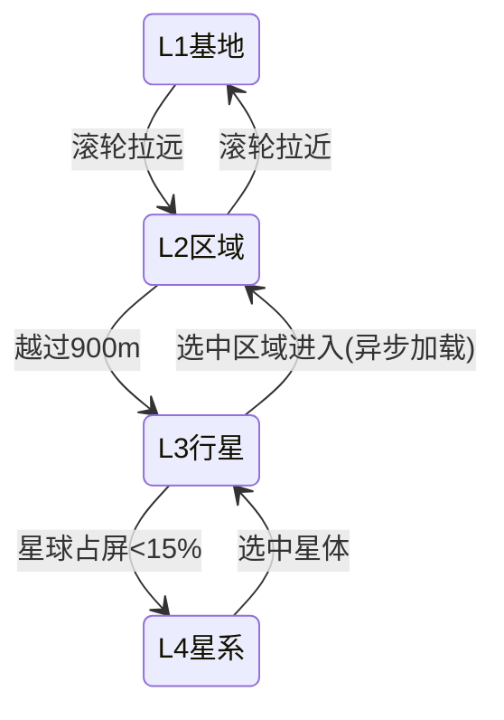

# 05 缩放分层与呈现

用户需求原文对应:"缩放分层(第一层看得清基地,第二层远景,第三层所在的星球,第四层所处的星系)"。本文档把四层定死,并定义相机、切换、输入、美术方向、UI 骨架与音频。

## 四层定义

| 层 | 名称 | 相机 | 看什么 | 能做什么 | 模拟状态 |
|---|---|---|---|---|---|
| L1 | 基地层 | 距地 12–120m,俯仰 40°–70°,自由旋转,透视 FOV 30° | 全细节建筑、殖民者与机器人动画、资源堆、建造网格 | 全部建造与管理操作、个体信息面板、手工指令 | 活跃区域全量模拟 |
| L2 | 区域层 | 距地 120–900m,俯仰锁 55°–75° | 整块区域远景:建筑替换为体块 LOD 与图标牌,殖民者隐藏 | 蓝图印章、区划、电力/氧气/物流覆盖叠加图、告警定位 | 同 L1(同一场景) |
| L3 | 行星层 | 星球场景,轨道相机环绕 | 星球全貌:登陆区块、矿脉摘要、势力疆域染色、灾害天气、昼夜线 | 选区进入(L1/L2)、前哨选址、发射与着陆选点、区域摘要卡 | 本星非活跃区域走抽象刻 |
| L4 | 星系层 | 俯视星系平面,可倾斜 ±20° | 曦光与 12 星体、轨道、在途火箭与货轮、贸易航线、势力疆域与实力条、情报层 | 派遣火箭、设定航线、外交面板、星体详情 | 势力沙盘星图刻 |

## 层间切换(ZoomDirector)

- 单一连续缩放轴:滚轮控制。L1 与 L2 是同一场景内的连续过渡(LOD 换挡在 300m 高度);L2 顶到 900m 继续滚轮即触发 L2→L3 过场;L3 拉远到星球占屏 <15% 触发 L3→L4;反向同理。
- 过场规格:L2↔L3 0.8 秒(相机拉升穿薄云层,区域图渐隐为星球表面色块);L3↔L4 0.6 秒(星球缩为轨道点)。过场期间输入锁定,可被 Esc 中断回到起点层。
- 区域加载:L3 选区进入时异步加载区域场景,遮罩转场 ≤3 秒(中配机验收);预算内预热玩家最近访问的 2 个区域。
- 快捷跳转:Home 键回主基地 L1;数字键 1–4 直达四层(保持当前焦点星体/区域)。

- 性能验收(M4):从 L1 一路滚轮到 L4 再回来,全程无 >100ms 的单帧尖峰(中配机,基准场景)。

## 输入映射(键鼠,首发唯一输入方案)

| 操作 | 绑定 |
|---|---|
| 平移 | WASD / 鼠标中键拖拽 / 屏幕边缘推移(设置可关) |
| 旋转 | Q/E(45° 步进)+ 右键拖拽自由旋转 |
| 缩放 | 滚轮(跨层连续) |
| 暂停与速度 | 空格暂停;F1–F3 = 1×/2×/4× |
| 建造菜单 | B;旋转蓝图 R;取消 Esc |
| 蓝图印章 | 按住 Ctrl 框选复制 |
| 告警跳转 | 点击告警条目跳转至事发位置(跨层自动切换) |
| 全键位可重绑 | 设置界面,Input System 动作表 |

## 美术方向

- 风格 token:低多边形、圆角硬边、大色块、每材质 ≤3 阶渐变、禁用噪点细节纹理;45° 俯视下剪影可辨识是硬性要求(任何两种建筑在 L2 体块状态下不得混淆)。
- 功能色系:采集橙、加工蓝灰、电力黄、生保绿、居住暖木、军事红、航天白、势力建筑各用其势力色(商盟金、赤旗绯红、静默会靛蓝)。
- 角色:圆胖宇航服小人 1 套骨骼 + 3 种配色;蛛型机器人 4 种剪影(搬运矮扁、工程高举臂、采矿前钻、战斗宽足);无人机 1 种。
- 环境:每星体一套地表调色板与天空盒(12 套),地形为分阶台地风格(呼应 Timberborn 的台地感,但为干燥星球质感)。
- 灰盒先行:全部玩法验收使用灰盒占位模型(纯色 + 功能色系),正式美术在 M7 后统一冲刺替换(见 `09` M8 前置任务)。美术替换不得改变建筑占地与碰撞。

## 图标语法(IconComposer)

全部物品图标(约 340 个)由工具自动合成:`材料底色 + 形态字形 + 工艺角标` 三层叠加。例:铝(银白底)+ 线(线圈字形)+ 拉丝角标。规则:

- 材料底色表与形态字形集(14 个矢量字形)入库,人工绘制一次。
- 高频物品(出现在 HUD 常驻栏或教学中的约 40 个)由人工重绘覆盖自动版。
- 验收:任意两个物品图标在 32×32 尺寸下经色觉模拟(三种色盲模式)仍可区分(自动对比度检查 + 人工抽查 30 对)。

## UI 骨架(UI Toolkit)

- 顶栏:资源摘要(电、氧、水、食物、星币、人口)、时间与速度控制、告警入口。
- 左侧:建造菜单(按建筑类别分组,搜索框)。
- 右侧:选中对象的信息面板(建筑/单位/矿脉/势力星体共用容器,内容模板化)。
- 底部:告警条与事件日志;L3/L4 时替换为区域摘要卡列表 / 星体列表。
- 全屏界面:科技树、配方浏览器、职业面板、外交面板、贸易面板、存档管理、设置。
- 缩放适配:UI 缩放 80%–150% 设置项;最低支持 1280×720,基准 1920×1080。

## 音频方向

- 使用 Unity 内置音频与混音器,不引入 FMOD/Wwise(锁定决策,控制依赖)。
- SFX 清单 60 条封闭集合(建造、采集、机器运转分家族、告警、UI、战斗、火箭)。机器运转声按"家族 + 转速层"复用,不逐建筑录制。
- 音乐 8 轨:主题 1、尘壤日常 2、危机 1、星图 2、战斗 1、终局 1。外包或曲库采购,预算与选曲为用户决策项(见 `10`)。
- 无配音。告警用音效 + 文字。
