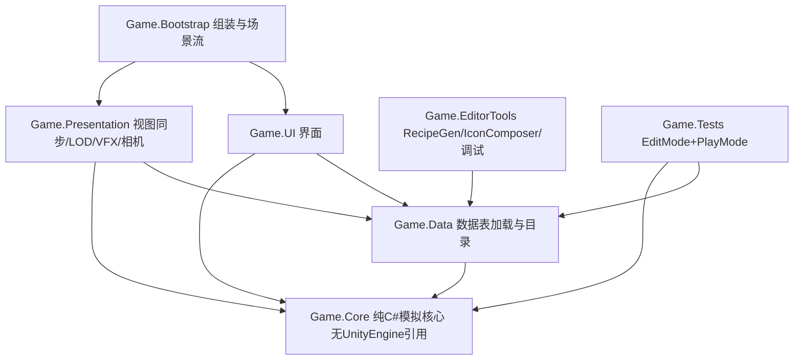

# 08 技术架构

本文档定义技术栈、模块划分、模拟核心、数据管线、存档、性能预算、测试策略与 CI。执行 agent 在 M0 按本文档搭骨架,之后所有里程碑遵守此结构。

## 技术栈(锁定)

| 项 | 选择 | 说明 |
|---|---|---|
| 引擎 | Unity 6.3 LTS(6000.3 系列最新补丁;计划撰写时为 6000.3.21f1) | 支持期到 2027-12(来源:unity.com/releases/unity-6/support)。升级只在里程碑边界、只升补丁号 |
| 渲染管线 | URP | 风格化低多边形,性能余量给模拟 |
| UI | UI Toolkit | 数据密集界面多,运行时数据绑定 |
| 输入 | Input System(包) | 全键位重绑需求 |
| 本地化 | Unity Localization(包) | zh-CN 源语言 + en |
| 数学与作业 | Unity.Mathematics + Burst + Collections + Jobs | 仅用于寻路与批量结算热点;模拟主体是普通 C# |
| JSON | com.unity.nuget.newtonsoft-json | 存档与数据表 |
| Steam | Steamworks.NET(UPM git 引用,锁定 release tag;计划撰写时最新 2025.163.0,对应 Steamworks SDK 1.63) | 仅在 M8 引入,构建脚本按有无 `STEAM` 宏区分 |
| 相机 | 自研 ZoomDirector | 不用 Cinemachine,跨层状态机自己写更可控 |
| 崩溃报告 | Sentry Unity SDK | DSN 由用户提供为 CI Secret,无 DSN 时本地落盘 |

## 模块划分(asmdef)



硬性规则:`Game.Core` 禁止引用 UnityEngine(asmdef 引用列表为空 + CI 静态检查)。它包含:tick 循环、区域模拟、需求、电力/氧气/物流结算、寻路请求接口、配方求解、势力沙盘、抽象刻、存档模型。这使得平衡模拟器与 CI 测试完全脱离 Unity 运行。

## 目录结构

```
Assets/
  _Game/
    Core/            (Game.Core)
    Data/            (Game.Data + ScriptableObject 目录资产)
    Presentation/    (Game.Presentation)
    UI/              (Game.UI + UXML/USS)
    Bootstrap/       (Game.Bootstrap + 场景)
    Art/             (灰盒与正式资产,按 Blockout/Final 分层)
    Audio/
  GeneratedData/     (RecipeGen 输出的 JSON 与图标图集,入库)
tools/
  BalanceSim/        (net8 控制台工程,源码级引用 Assets/_Game/Core/**/*.cs)
  RecipeGen/         (net8 控制台,读 data/*.csv 写 GeneratedData/)
data/                (人工维护的 CSV,见 04)
steam/               (steamcmd 上传脚本与 depot 配置,M8)
docs/plan/           (本计划)
```

`tools/` 下的工程通过 csproj 通配符直接编译 `Game.Core` 源码,不依赖 Unity;这是 CI 第一道门的基础。

## 模拟核心

- 固定步长:tick 为唯一时间单位(常量见 `02`)。`World.Tick()` 顺序:输入命令队列 → 殖民者/机器人决策与移动 → 机器加工 → 网络结算(电/氧)→ 物流派工 → 需求与士气 → 灾害 → (整点)星图刻与抽象刻 → 事件出队。
- 命令模式:所有玩家操作封装为命令对象进队,在 tick 边界应用。UI 永不直接改模拟状态。
- 确定性:单机确定性即可(无联机)。全部随机数走 `Game.Core.Rng`,按命名流(地形、灾害、势力、战斗……)从游戏种子派生;模拟代码禁用 `System.Random`、`UnityEngine.Random`、时钟与浮点不定序归约。同种子同命令序列重放结果一致(测试依赖)。
- 事件总线:类型化事件(建筑完成、袭击预警、殖民者死亡……),Presentation 与 UI 只订阅不轮询。

## 寻路

- 网格 A*(8 向,悬崖不可越,道路降代价);192×192 以上启用分层(HPA*,簇 16×16)。
- 实现为 Burst 化 job,主线程只发请求收结果;每 tick 寻路预算 2ms,超预算请求排队到下 tick(个体等待原地)。

## 数据管线

- 人工 CSV(`data/`)→ `RecipeGen` → `GeneratedData/*.json` + 校验报告 → `Game.Data` 启动时加载为不可变目录(物品、配方、建筑、科技、势力参数)。
- 所有数值(速率、成本、需求消耗、势力常数)只存在于数据表,代码零魔法数字(CI 静态检查:`Game.Core` 内数字字面量白名单)。
- 图标:`IconComposer` 编辑器工具按 `05` 图标语法合成图集。

## 存档

- 格式:JSON + gzip,分块:`header`(版本、种子、游戏时间)、`world`(星图、势力)、`regions[]`(逐区域)、`player`(科技、配方、账本)。
- 版本与迁移:`schemaVersion` 整数递增;迁移注册表按版本链式执行;读档失败回滚到最近可用自动存档并弹出报告。
- 自动存档:每 5 真实分钟(设置可调),3 个轮换槽 + 每游戏日 1 个日档;手动槽不限。
- 性能口径:典型存档(5 区域)≤25MB;写盘异步,主线程停顿 ≤200ms——超过此值才允许启动二进制化改造(锁定触发条件)。

## 渲染与表现

- 建筑三级表现:L1 全模型 → L2 体块 + 图标牌(300m 换挡)→ L3 不渲染个体建筑(区域摘要色块)。
- 静态合批 + GPU 实例化按建筑类型分桶;殖民者/机器人用实例化蒙皮(上限见预算表)。
- 地形:高度阶地网格按 32×32 块生成与剔除;12 套星体调色板由材质参数驱动,不复制网格资产。

## 性能预算(中配:Ryzen 5 5600 / RTX 3060 / 16GB / 1080p)

| 指标 | 预算 | 基准场景 |
|---|---|---|
| L1 帧率 | ≥60fps,300 建筑 + 180 个体 | `Benchmarks/BaseFull` |
| 模拟 tick 耗时 | 4× 速度下均值 ≤6ms(1 活跃区域 + 11 抽象区域 + 3 势力) | `Benchmarks/SimLoad`(纯 C# 可跑) |
| 跨层缩放 | L1→L4→L1 无 >100ms 帧尖峰 | `Benchmarks/ZoomSweep` |
| 读档 | 5 区域存档 ≤10s;区域切换 ≤3s | `Benchmarks/SaveLoad` |
| 内存 | 峰值 ≤6GB | 全部场景 |
| 最低配 | GTX 1060 / 16GB:1080p 中画质 ≥30fps | `BaseFull` 中画质 |

预算是验收标准,不是愿望:M4 起每个里程碑收尾必须跑基准场景并把数字写进验收报告。

## 测试策略

| 层 | 内容 | 运行环境 |
|---|---|---|
| EditMode 单测 | 需求衰减边界、配方求解、电网结算、氧网结算、派工竞拍、寻路正确性、势力成长与扩张、价格钳制、存档往返(序列化→反序列化→逐字段一致)、抽象刻偏差 | Unity CI 或本地 |
| 纯 C# 测试 | 与上重合的 Core 部分直接在 `tools/BalanceSim` 测试工程跑(无 Unity) | dotnet,CI 第一道门 |
| BalanceSim 场景 | F1–F6(势力,见 `07`)、E1 徒手生存 10 游戏日、E2 零人力稳态 24 游戏时、E3 脚本化推进到 T3 发射 | dotnet |
| PlayMode 冒烟 | 启动 → 新档 → 放 3 种建筑 → 存档 → 读档 → 退出,全程 0 Error 日志 | Unity CI |
| 变异验证 | M1/M3/M6 各选 1 条关键测试:人为改坏实现 → 测试变红 → 还原 → 变绿,过程记录进验收报告 | 手动协议 |
| Soak | 4 真实小时自动游玩脚本(随机建造 + 4× 速度),内存增长 <10%/小时,0 崩溃 | 夜间任务 |

## CI(GitHub Actions)

- 门 1(每 PR,无 Unity 许可即可跑):`dotnet test tools/BalanceSim` + `dotnet run --project tools/RecipeGen -- --validate`(0 错误)+ Core 禁引用检查 + 魔法数字检查。
- 门 2(每 PR,需 `UNITY_LICENSE` Secret,由用户提供):EditMode + PlayMode 测试,Windows/Linux 构建产物(命名 `Starsoil_{platform}_{sha}`)。Secret 未配置时门 2 跳过并在 PR 标注,不阻断门 1。
- 门 3(手动触发,M8 起):steamcmd 上传到 Steam `internal` 分支,需用户提供的 Steam 构建凭据 Secret。

## 编码规范(要点)

- 命名空间 `Starsoil.Core` / `Starsoil.Data` / `Starsoil.Presentation` / `Starsoil.UI`。
- 禁全局单例;服务经 `Bootstrap` 组装注入。禁超过 500 行的"上帝管理器"类(CI 行数检查,白名单需评审)。
- 模拟状态全部可序列化 POCO;表现层对象绝不持有模拟真值。
- 注释与提交信息使用英文(仓库既有语言随首个里程碑定型后统一);玩家可见文本一律走本地化表。
